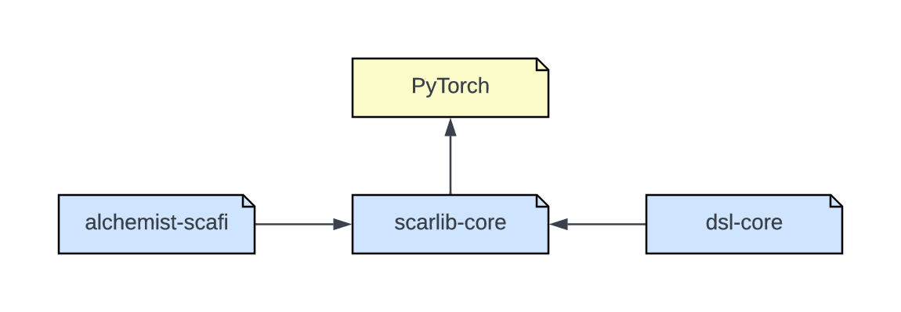

# ScaRLib -- Scala Multi-Agent Deep Reinforcement Learning Framework.
ScaRLib is a Scala library for defining collaborative learning systems with many agents, namely: CMARL systems. 
In particular, this library offers:
- Centralized and decentralized learning modes
- Typed DSL used for defining multi-agent learning tasks
- Binding with state-of-the-art deep learning libraries (torch)
- Integration with Alchemist (a large-scale multi-agent simulator) and ScaFi (an aggregate programming language) to define typical scenarios in collective adaptive  system.

## ScaRLib submodules



### ScaRLib Core
The module `scarlib-core` implements all the abstractions that model the CMARL domain. 
The key element is the `system`, it might be of two different types: 
    i) Centralized Training Decentralized Execution system (`CTDESystem`)
    ii) Decentralized Training Decentralized Execution system (`DTDESystem`).
Basically, the system, is a collection of agents that interact within a shared environment
and that are trained to optimize a global or local reward signal expressed by
a reward function. 
Through this definition, we have mentioned the remaining concepts of the CMARL domain,
therefore, to create an experiment, it is necessary to define six basic elements:

- Action space: the set of actions each agent can perform, it could be easily defined 
        extending the trait `Action`, for example:
  ```scala
  object ActionSpace {
    case object North extends Action
    case object South extends Action
    case object East extends Action
    case object West extends Action
  
    def toSeq() = Seq(North, South, East, West)
  }
  ```
  
- State: represents all the information an agent knows about the Environment at a certain time, 
    it must extend the trait `State`

- Reward function: defines how good is an action given the state in which the agent is
     ```scala
  class SimpleRewardFunction() extends RewardFunction {
        def compute(currentState: State, action: Action, newState: State): Double = ???
  }
  ```
  
- Environment: provides feedback to the agent in the form of rewards or penalties 
      for each action taken in a given state

- Dataset: the storage for the experience accumulated over the time by the agents. 
    The tool provides a simple buffered queue, if needed a user might implement his own dataset 
    extending the trait `ReplayBuffer`

- Agents: the number of agents involved in the experiment

Another pre-implemented component is the learning algorithm: the DQN. It approximates the Q-function used in the 
    Q-Learning algorithm with a Neural Network to deal with the explosion of the state space.
    As with all the ML algorithms there are some hyper-parameters we can tune to optimize the learning, 
    for that reason we provide a way to specify them in a single point:
```scala
  case class LearningConfiguration(
    epsilon: Decay[Double] = new ExponentialDecay(0.9, 0.1, 0.01),
    gamma: Double = 0.9,
    learningRate: Double = 0.0005,
    batchSize: Int = 32,
    updateEach: Int = 100,
    random: Random = new Random(1),
    dqnFactory: DQNAbstractFactory
  )
  ```


### Alchemist - Scafi
The module `alchemist-scafi` provides the bindings with two state-of-the-art tools, 
    namely: [Scafi](https://github.com/scafi/scafi) 
    and [Alchemist](http://alchemistsimulator.github.io/).
The integration of these two tools is a game-changer because it introduces 
    significant potential in ScaRLib: 
    i) Scafi enables the usage of the Aggregate Programming paradigms 
        to express collective behaviours for the agents
    ii) Alchemist enables the definition of large-scale sets of agents 
        in complex distributed systems (e.g., swarm robotics).

The definition of an experiment does not change significantly, only two elements are added:

- Alchemist simulation definition: basically it is a YAML file containing the description 
    of the alchemist environment, for example:
    ```yaml
    incarnation: scafi
    network-model:
        type: ConnectWithinDistance
        parameters: [0.5]
    deployments:
        type: Grid
        parameters: [-5,-5,5,5,0.25,0.25]
    programs:
        - program:
        - time-distribution: 1
          type: Event
          actions:
          - type: RunScafiProgram
            parameters: [program]
        - program: send
    ```
- Aggregate program: the Scafi program that express the aggregate logic. For example,
    if we want express the state as the distances from the neighbours:
    ```scala
      val state = foldhoodPlus(Seq.empty)(_ ++ _)(Set(nbrVector))
    ```
### DSL Core
The module `dsl-core` allows for agile and flexible creation of CMARL training systems.  
Using a system like Scala, creating a typed DSL allows for capturing errors during compilation, rather than waiting
    for the actual system runs to intercept simple configuration errors.
The exposed DSL is a simple facade to the abstractions shown in the `scarlib-core` module.
An example of DSL usage is the following:
```scala
val system = learningSystem {
    rewardFunction { new MyRewardFunction() } 
    actions { MyAction.all} // action supported by the agent
    dataset { ReplayBuffer[State, Action](10000) } // shared memory
    agents { 50 } // select the number of agent
    environment {
        // select a specific environment
        "it.unibo.scarlib.experiments.myEnvironment"
    }
}
```

## How to use it:
The tool is published on Maven. 
To integrate it into your own repository, you need to add (using Gradle):
```kotlin
implementation("io.github.davidedomini:scarlib-core:$version")
implementation("io.github.davidedomini:dsl-core:$version")
```

## Quik start-up

To speed up the process of developing new experiments, we have provided a [template repository](https://github.com/ScaRLib-group/ScaRLib-experiments-startup) from which you can start, ensuring:
- Necessary libraries are pre-imported
- Docker is configured to run everything in a virtual environment

### Contributors

<a href="https://github.com/AlchemistSimulator/Alchemist/graphs/contributors">
	
</a>

